# Quest Basic Kotlin — Ramiza Kamala Tatsuru (20220140006)

Praktikum Pemrograman Aplikasi Mobile (PAM). 11 sub bab, satu file Kotlin per sub bab,
setiap sub bab dikerjakan dalam satu commit.

Semua kode dijalankan di **Kotlin Playground** (<https://play.kotlinlang.org>).
Tiap sub bab di bawah ini memuat file kodenya, tautan playground yang sudah berisi kode itu,
dan screenshot hasil running-nya (full layar, tanpa crop).

---

## 1. Variables

[`subbab/01_Variables.kt`](subbab/01_Variables.kt) · [buka di Kotlin Playground](https://play.kotlinlang.org/#eyJ2ZXJzaW9uIjoiMi40LjIwIiwicGxhdGZvcm0iOiJqYXZhIiwiYXJncyI6IiIsIm5vbmVNYXJrZXJzIjp0cnVlLCJ0aGVtZSI6ImlkZWEiLCJjb2RlIjoiZnVuIG1haW4oKSB7XG4gICAgLy8gdmFyaWFiZWwgcmVhZC1vbmx5IGRlbmdhbiB2YWxcbiAgICB2YWwgbmFtYSA9IFwiS290bGluXCJcbiAgICB2YWwgdmVyc2kgPSBcIjIuNC4yMFwiXG5cbiAgICAvLyB2YXJpYWJlbCB5YW5nIGRhcGF0IGRpdWJhaCBkZW5nYW4gdmFyXG4gICAgdmFyIGp1bWxhaEJhcmlzID0gNVxuXG4gICAgLy8gdW50dWsgbWVuZXRhcGthbiBuaWxhaSwgZ3VuYWthbiBvcGVyYXRvciBwZW51Z2FzYW4gPVxuICAgIGp1bWxhaEJhcmlzID0ganVtbGFoQmFyaXMgKyAyXG5cbiAgICBwcmludGxuKG5hbWEpXG4gICAgcHJpbnRsbih2ZXJzaSlcbiAgICBwcmludGxuKGp1bWxhaEJhcmlzKVxufVxuIiwiY29tcGlsZXJBcmd1bWVudHMiOnt9fQ==)

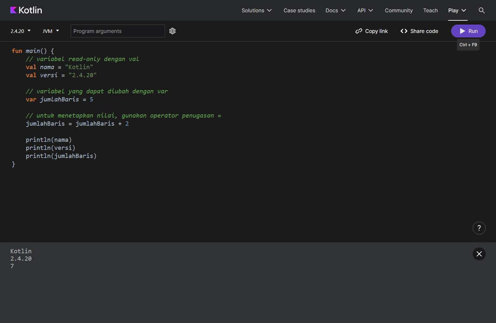

---

## 2. String templates

[`subbab/02_StringTemplates.kt`](subbab/02_StringTemplates.kt) · [buka di Kotlin Playground](https://play.kotlinlang.org/#eyJ2ZXJzaW9uIjoiMi40LjIwIiwicGxhdGZvcm0iOiJqYXZhIiwiYXJncyI6IiIsIm5vbmVNYXJrZXJzIjp0cnVlLCJ0aGVtZSI6ImlkZWEiLCJjb2RlIjoiZnVuIG1haW4oKSB7XG4gICAgdmFsIGN1c3RvbWVycyA9IDEwXG4gICAgcHJpbnRsbihcIlRoZXJlIGFyZSAkY3VzdG9tZXJzIGN1c3RvbWVyc1wiKVxuXG4gICAgLy8gZWtzcHJlc2kgdGVtcGxhdGUgZGVuZ2FuICR2YXJpYWJlbFxuICAgIHZhbCBuYW1hID0gXCJLb3RsaW5cIlxuICAgIHByaW50bG4oXCJIZWxsbywgJG5hbWFcIilcblxuICAgIC8vIGVrc3ByZXNpIHRlbXBsYXRlIGRlbmdhbiAke2tvZGV9IHlhbmcgZGlldmFsdWFzaSBsYWx1IGRpdWJhaCBtZW5qYWRpIHN0cmluZ1xuICAgIHZhbCBoYXJnYSA9IDE1MDAwXG4gICAgdmFsIGp1bWxhaCA9IDNcbiAgICBwcmludGxuKFwiVG90YWwgYmF5YXI6ICR7aGFyZ2EgKiBqdW1sYWh9XCIpXG59XG4iLCJjb21waWxlckFyZ3VtZW50cyI6e319)

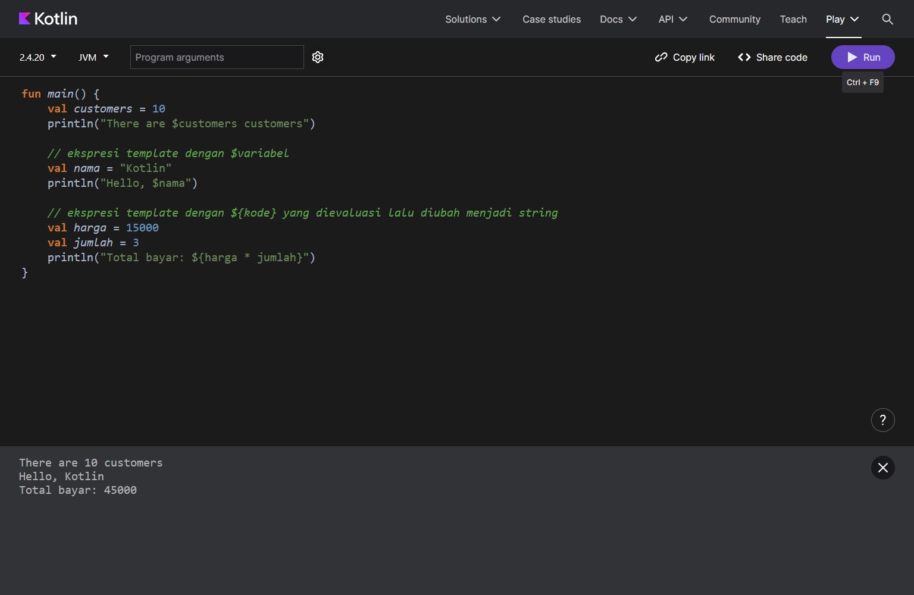

---

## 3. Tipe Data Dasar

[`subbab/03_TipeDataDasar.kt`](subbab/03_TipeDataDasar.kt) · [buka di Kotlin Playground](https://play.kotlinlang.org/#eyJ2ZXJzaW9uIjoiMi40LjIwIiwicGxhdGZvcm0iOiJqYXZhIiwiYXJncyI6IiIsIm5vbmVNYXJrZXJzIjp0cnVlLCJ0aGVtZSI6ImlkZWEiLCJjb2RlIjoiZnVuIG1haW4oKSB7XG4gICAgLy8gVmFyaWFibGUgZGlkZWtsYXJhc2lrYW4gdGFucGEgaW5pc2lhbGlzYXNpXG4gICAgdmFsIGQ6IEludFxuICAgIC8vIFZhcmlhYmxlIGRlbmdhbiBpbmlzaWFsaXNhc2lcbiAgICBkID0gM1xuICAgIC8vIFZhcmlhYmxlIGplbmlzIGV4cGxpY2l0IGRhbiBkaSBpbmlzaWFsaXNhc2lcbiAgICB2YWwgZTogU3RyaW5nID0gXCJoZWxsb1wiXG5cbiAgICBwcmludGxuKFwiZCA9ICRkXCIpXG4gICAgcHJpbnRsbihcImUgPSAkZVwiKVxuXG4gICAgLy8gSW50ZWdlcnNcbiAgICB2YWwgYmlsYW5nYW5CdWxhdDogSW50ID0gMTAwXG4gICAgLy8gVW5zaWduZWQgaW50ZWdlcnNcbiAgICB2YWwgYmlsYW5nYW5CdWxhdFRhbnBhVGFuZGE6IFVJbnQgPSAyMDB1XG4gICAgLy8gRmxvYXRpbmctcG9pbnQgbnVtYmVyc1xuICAgIHZhbCBiaWxhbmdhblBlY2FoYW46IERvdWJsZSA9IDMuMTRcbiAgICAvLyBCb29sZWFuc1xuICAgIHZhbCBib29sZWFuOiBCb29sZWFuID0gdHJ1ZVxuICAgIC8vIENoYXJhY3RlcnNcbiAgICB2YWwga2FyYWt0ZXI6IENoYXIgPSAnUidcbiAgICAvLyBTdHJpbmdzXG4gICAgdmFsIHRla3M6IFN0cmluZyA9IFwiS290bGluXCJcblxuICAgIHByaW50bG4oXCJJbnRlZ2VycyAgICAgICAgICA6ICRiaWxhbmdhbkJ1bGF0XCIpXG4gICAgcHJpbnRsbihcIlVuc2lnbmVkIGludGVnZXJzIDogJGJpbGFuZ2FuQnVsYXRUYW5wYVRhbmRhXCIpXG4gICAgcHJpbnRsbihcIkZsb2F0aW5nLXBvaW50ICAgIDogJGJpbGFuZ2FuUGVjYWhhblwiKVxuICAgIHByaW50bG4oXCJCb29sZWFucyAgICAgICAgICA6ICRib29sZWFuXCIpXG4gICAgcHJpbnRsbihcIkNoYXJhY3RlcnMgICAgICAgIDogJGthcmFrdGVyXCIpXG4gICAgcHJpbnRsbihcIlN0cmluZ3MgICAgICAgICAgIDogJHRla3NcIilcbn1cbiIsImNvbXBpbGVyQXJndW1lbnRzIjp7fX0=)

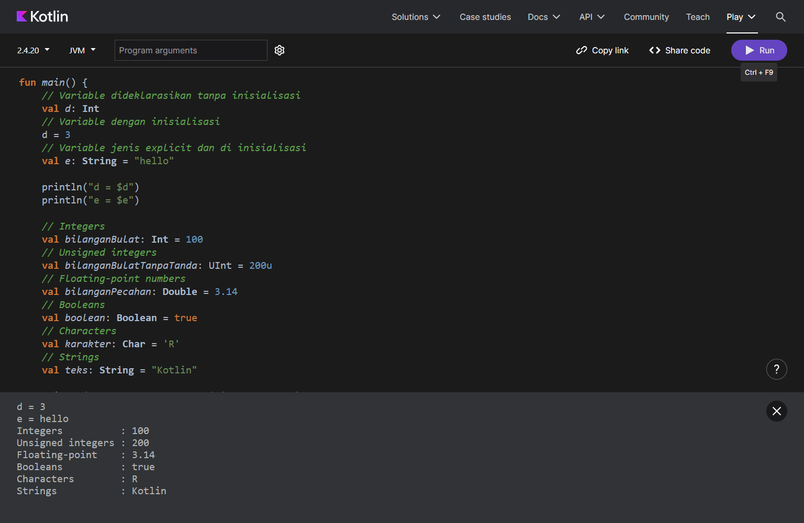

---

## 4. Collection

[`subbab/04_Collection.kt`](subbab/04_Collection.kt) · [buka di Kotlin Playground](https://play.kotlinlang.org/#eyJ2ZXJzaW9uIjoiMi40LjIwIiwicGxhdGZvcm0iOiJqYXZhIiwiYXJncyI6IiIsIm5vbmVNYXJrZXJzIjp0cnVlLCJ0aGVtZSI6ImlkZWEiLCJjb2RlIjoiZnVuIG1haW4oKSB7XG4gICAgLy8gTGlzdFxuICAgIC8vIFJlYWQgb25seSBsaXN0XG4gICAgdmFsIHJlYWRPbmx5U2hhcGVzID0gbGlzdE9mKFwidHJpYW5nbGVcIiwgXCJzcXVhcmVcIiwgXCJjaXJjbGVcIilcbiAgICBwcmludGxuKHJlYWRPbmx5U2hhcGVzKVxuICAgIC8vIFt0cmlhbmdsZSwgc3F1YXJlLCBjaXJjbGVdXG5cbiAgICAvLyBNdXRhYmxlIGxpc3Qgd2l0aCBleHBsaWNpdCB0eXBlIGRlY2xhcmF0aW9uXG4gICAgdmFsIHNoYXBlczogTXV0YWJsZUxpc3Q8U3RyaW5nPiA9IG11dGFibGVMaXN0T2YoXCJ0cmlhbmdsZVwiLCBcInNxdWFyZVwiLCBcImNpcmNsZVwiKVxuICAgIHByaW50bG4oc2hhcGVzKVxuICAgIC8vIFt0cmlhbmdsZSwgc3F1YXJlLCBjaXJjbGVdXG5cbiAgICAvLyBWaWV3IHJlYWQtb25seSBkYXJpIG11dGFibGUgTGlzdFxuICAgIHZhbCBzaGFwZXNMb2NrZWQ6IExpc3Q8U3RyaW5nPiA9IHNoYXBlc1xuICAgIHByaW50bG4oc2hhcGVzTG9ja2VkKVxuXG4gICAgLy8gT3BlcmF0b3IgYWtzZXMgdGVyaW5kZWtzIFtdXG4gICAgcHJpbnRsbihcIkl0ZW0gcGVydGFtYTogJHtzaGFwZXNbMF19XCIpXG4gICAgLy8gSXRlbSBwZXJ0YW1hIGRhbiB0ZXJha2hpclxuICAgIHByaW50bG4oXCJJdGVtIHBlcnRhbWE6ICR7c2hhcGVzLmZpcnN0KCl9XCIpXG4gICAgcHJpbnRsbihcIkl0ZW0gdGVyYWtoaXI6ICR7c2hhcGVzLmxhc3QoKX1cIilcbiAgICAvLyBKdW1sYWggaXRlbVxuICAgIHByaW50bG4oXCJKdW1sYWggaXRlbTogJHtzaGFwZXMuY291bnQoKX1cIilcbiAgICAvLyBNZW1lcmlrc2EgYXBha2FoIHNlYnVhaCBpdGVtIGFkYSBkaSBkYWxhbSBMaXN0XG4gICAgcHJpbnRsbihcIkFwYWthaCBhZGEgJ2NpcmNsZSc/ICR7XCJjaXJjbGVcIiBpbiBzaGFwZXN9XCIpXG4gICAgLy8gTWVuYW1iYWggZGFuIG1lbmdoYXB1cyBpdGVtXG4gICAgc2hhcGVzLmFkZChcInBlbnRhZ29uXCIpXG4gICAgcHJpbnRsbihzaGFwZXMpXG4gICAgc2hhcGVzLnJlbW92ZShcInRyaWFuZ2xlXCIpXG4gICAgcHJpbnRsbihzaGFwZXMpXG5cbiAgICAvLyBTZXRcbiAgICAvLyBSZWFkLW9ubHkgc2V0XG4gICAgdmFsIHJlYWRPbmx5RnJ1aXQgPSBzZXRPZihcImFwcGxlXCIsIFwiYmFuYW5hXCIsIFwiY2hlcnJ5XCIsIFwiY2hlcnJ5XCIpXG4gICAgLy8gTXV0YWJsZSBzZXQgd2l0aCBleHBsaWNpdCB0eXBlIGRlY2xhcmF0aW9uXG4gICAgdmFsIGZydWl0OiBNdXRhYmxlU2V0PFN0cmluZz4gPSBtdXRhYmxlU2V0T2YoXCJhcHBsZVwiLCBcImJhbmFuYVwiLCBcImNoZXJyeVwiLCBcImNoZXJyeVwiKVxuICAgIHByaW50bG4ocmVhZE9ubHlGcnVpdClcbiAgICAvLyBbYXBwbGUsIGJhbmFuYSwgY2hlcnJ5XVxuXG4gICAgLy8gVmlldyByZWFkLW9ubHkgZGFyaSBtdXRhYmxlIFNldFxuICAgIHZhbCBmcnVpdExvY2tlZDogU2V0PFN0cmluZz4gPSBmcnVpdFxuICAgIHByaW50bG4oZnJ1aXRMb2NrZWQpXG5cbiAgICAvLyBKdW1sYWggaXRlbVxuICAgIHByaW50bG4oXCJKdW1sYWggaXRlbTogJHtmcnVpdC5jb3VudCgpfVwiKVxuICAgIC8vIE1lbWVyaWtzYSBhcGFrYWggc2VidWFoIGl0ZW0gYWRhIGRpIGRhbGFtIFNldFxuICAgIHByaW50bG4oXCJBcGFrYWggYWRhICdhcHBsZSc/ICR7XCJhcHBsZVwiIGluIGZydWl0fVwiKVxuICAgIC8vIE1lbmFtYmFoIGRhbiBtZW5naGFwdXMgaXRlbVxuICAgIGZydWl0LmFkZChcIm1hbmdvXCIpXG4gICAgcHJpbnRsbihmcnVpdClcbiAgICBmcnVpdC5yZW1vdmUoXCJiYW5hbmFcIilcbiAgICBwcmludGxuKGZydWl0KVxuXG4gICAgLy8gTWFwXG4gICAgLy8gUmVhZC1vbmx5IG1hcFxuICAgIHZhbCByZWFkT25seUp1aWNlTWVudSA9IG1hcE9mKFwiYXBwbGVcIiB0byAxMDAsIFwia2l3aVwiIHRvIDE5MCwgXCJvcmFuZ2VcIiB0byAxMDApXG4gICAgcHJpbnRsbihyZWFkT25seUp1aWNlTWVudSlcbiAgICAvLyB7YXBwbGU9MTAwLCBraXdpPTE5MCwgb3JhbmdlPTEwMH1cblxuICAgIC8vIE11dGFibGUgbWFwIHdpdGggZXhwbGljaXQgdHlwZSBkZWNsYXJhdGlvblxuICAgIHZhbCBqdWljZU1lbnU6IE11dGFibGVNYXA8U3RyaW5nLCBJbnQ+ID0gbXV0YWJsZU1hcE9mKFwiYXBwbGVcIiB0byAxMDAsIFwia2l3aVwiIHRvIDE5MCwgXCJvcmFuZ2VcIiB0byAxMDApXG4gICAgcHJpbnRsbihqdWljZU1lbnUpXG4gICAgLy8ge2FwcGxlPTEwMCwga2l3aT0xOTAsIG9yYW5nZT0xMDB9XG5cbiAgICAvLyBWaWV3IHJlYWQtb25seSBkYXJpIG11dGFibGUgTWFwXG4gICAgdmFsIGp1aWNlTWVudUxvY2tlZDogTWFwPFN0cmluZywgSW50PiA9IGp1aWNlTWVudVxuICAgIHByaW50bG4oanVpY2VNZW51TG9ja2VkKVxuXG4gICAgLy8gTWVuZ2Frc2VzIG5pbGFpIHBhZGEgbWFwIGRlbmdhbiBrZXktbnlhXG4gICAgcHJpbnRsbihcIlRoZSB2YWx1ZSBvZiBhcHBsZSBqdWljZSBpczogJHtyZWFkT25seUp1aWNlTWVudVtcImFwcGxlXCJdfVwiKVxuICAgIC8vIFRoZSB2YWx1ZSBvZiBhcHBsZSBqdWljZSBpczogMTAwXG5cbiAgICAvLyBKdW1sYWggaXRlbVxuICAgIHByaW50bG4oXCJKdW1sYWggaXRlbTogJHtqdWljZU1lbnUuY291bnQoKX1cIilcbiAgICAvLyBNZW5hbWJhaCBkYW4gbWVuZ2hhcHVzIGl0ZW1cbiAgICBqdWljZU1lbnUucHV0KFwibWFuZ29cIiwgMTUwKVxuICAgIHByaW50bG4oanVpY2VNZW51KVxuICAgIGp1aWNlTWVudS5yZW1vdmUoXCJvcmFuZ2VcIilcbiAgICBwcmludGxuKGp1aWNlTWVudSlcbiAgICAvLyBNZW1lcmlrc2EgYXBha2FoIGtleSB0ZXJ0ZW50dSBzdWRhaCBkaXNlcnRha2FuIGRhbGFtIE1hcFxuICAgIHByaW50bG4oXCJBcGFrYWggYWRhIGtleSAna2l3aSc/ICR7anVpY2VNZW51LmNvbnRhaW5zS2V5KFwia2l3aVwiKX1cIilcbiAgICAvLyBNZW5kYXBhdGthbiBrb2xla3NpIGtleSBhdGF1IG5pbGFpXG4gICAgcHJpbnRsbihcIktleXM6ICR7anVpY2VNZW51LmtleXN9XCIpXG4gICAgcHJpbnRsbihcIlZhbHVlczogJHtqdWljZU1lbnUudmFsdWVzfVwiKVxuICAgIC8vIE1lbWVyaWtzYSBhcGFrYWgga2V5IGF0YXUgbmlsYWkgYWRhIGRpIGRhbGFtIE1hcFxuICAgIHByaW50bG4oXCJBcGFrYWgga2V5ICdhcHBsZScgYWRhPyAke1wiYXBwbGVcIiBpbiBqdWljZU1lbnUua2V5c31cIilcbn1cbiIsImNvbXBpbGVyQXJndW1lbnRzIjp7fX0=)

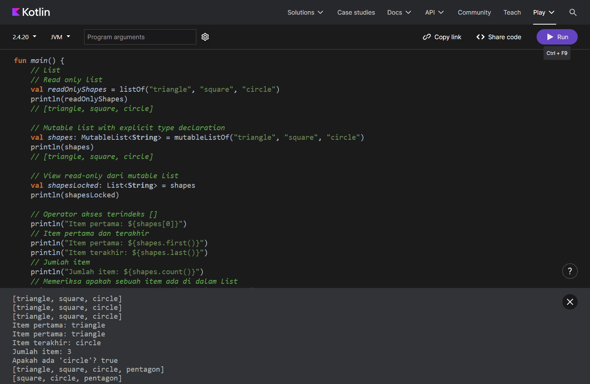

---

## 5. Conditional expressions

[`subbab/05_ConditionalExpressions.kt`](subbab/05_ConditionalExpressions.kt) · [buka di Kotlin Playground](https://play.kotlinlang.org/#eyJ2ZXJzaW9uIjoiMi40LjIwIiwicGxhdGZvcm0iOiJqYXZhIiwiYXJncyI6IiIsIm5vbmVNYXJrZXJzIjp0cnVlLCJ0aGVtZSI6ImlkZWEiLCJjb2RlIjoiZnVuIG1haW4oKSB7XG4gICAgLy8gSWZcbiAgICB2YWwgZDogSW50XG4gICAgdmFsIGNoZWNrID0gdHJ1ZVxuXG4gICAgaWYgKGNoZWNrKSB7XG4gICAgICAgIGQgPSAxXG4gICAgfSBlbHNlIHtcbiAgICAgICAgZCA9IDJcbiAgICB9XG5cbiAgICBwcmludGxuKGQpXG5cbiAgICAvLyBXaGVuIHNlYmFnYWkgc3RhdGVtZW50XG4gICAgdmFsIG9iaiA9IFwiSGVsbG9cIlxuXG4gICAgd2hlbiAob2JqKSB7XG4gICAgICAgIC8vIENoZWNrcyB3aGV0aGVyIG9iaiBlcXVhbHMgdG8gXCIxXCJcbiAgICAgICAgXCIxXCIgLT4gcHJpbnRsbihcIk9uZVwiKVxuICAgICAgICAvLyBDaGVja3Mgd2hldGhlciBvYmogZXF1YWxzIHRvIFwiSGVsbG9cIlxuICAgICAgICBcIkhlbGxvXCIgLT4gcHJpbnRsbihcIkdyZWV0aW5nXCIpXG4gICAgICAgIC8vIERlZmF1bHQgc3RhdGVtZW50XG4gICAgICAgIGVsc2UgLT4gcHJpbnRsbihcIlVua25vd25cIilcbiAgICB9XG4gICAgLy8gR3JlZXRpbmdcblxuICAgIC8vIFdoZW4gc2ViYWdhaSBla3NwcmVzaVxuICAgIHZhbCByZXN1bHQgPSB3aGVuIChvYmopIHtcbiAgICAgICAgLy8gSWYgb2JqIGVxdWFscyBcIjFcIiwgc2V0cyByZXN1bHQgdG8gXCJvbmVcIlxuICAgICAgICBcIjFcIiAtPiBcIk9uZVwiXG4gICAgICAgIC8vIElmIG9iaiBlcXVhbHMgXCJIZWxsb1wiLCBzZXRzIHJlc3VsdCB0byBcIkdyZWV0aW5nXCJcbiAgICAgICAgXCJIZWxsb1wiIC0+IFwiR3JlZXRpbmdcIlxuICAgICAgICAvLyBTZXRzIHJlc3VsdCB0byBcIlVua25vd25cIiBpZiBubyBwcmV2aW91cyBjb25kaXRpb24gaXMgc2F0aXNmaWVkXG4gICAgICAgIGVsc2UgLT4gXCJVbmtub3duXCJcbiAgICB9XG4gICAgcHJpbnRsbihyZXN1bHQpXG4gICAgLy8gR3JlZXRpbmdcbn1cbiIsImNvbXBpbGVyQXJndW1lbnRzIjp7fX0=)

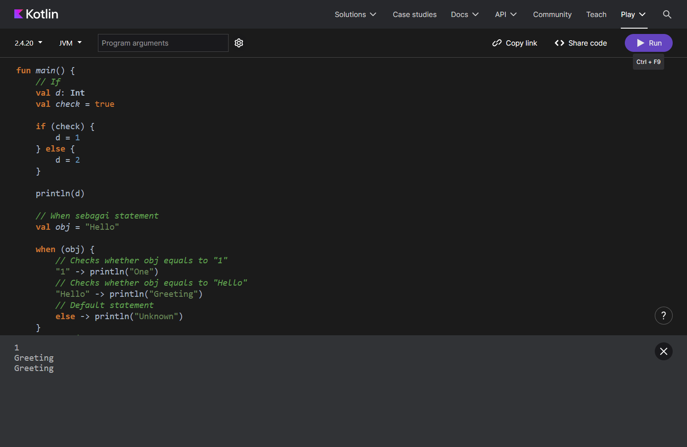

---

## 6. Ranges

[`subbab/06_Ranges.kt`](subbab/06_Ranges.kt) · [buka di Kotlin Playground](https://play.kotlinlang.org/#eyJ2ZXJzaW9uIjoiMi40LjIwIiwicGxhdGZvcm0iOiJqYXZhIiwiYXJncyI6IiIsIm5vbmVNYXJrZXJzIjp0cnVlLCJ0aGVtZSI6ImlkZWEiLCJjb2RlIjoiZnVuIG1haW4oKSB7XG4gICAgLy8gb3BlcmF0b3IgLi4gOiAxLi40IHNldGFyYSBkZW5nYW4gMSwgMiwgMywgNFxuICAgIHByaW50bG4oMS4uNClcblxuICAgIC8vIG9wZXJhdG9yIC4uPCA6IHJhbmdlIHlhbmcgdGlkYWsgbWVueWVydGFrYW4gbmlsYWkgYWtoaXIsIDEuLjw0IHNldGFyYSBkZW5nYW4gMSwgMiwgM1xuICAgIHByaW50bG4oMS4uPDQpXG5cbiAgICAvLyBkb3duVG8gOiByZW50YW5nIHVydXRhbiB0ZXJiYWxpaywgNCBkb3duVG8gMSBzZXRhcmEgZGVuZ2FuIDQsIDMsIDIsIDFcbiAgICBwcmludGxuKDQgZG93blRvIDEpXG5cbiAgICAvLyBzdGVwIDogcmVudGFuZyB5YW5nIGJlcnRhbWJhaCBkZW5nYW4gbGFuZ2thaCBidWthbiAxLCAxLi41IHN0ZXAgMiBzZXRhcmEgZGVuZ2FuIDEsIDMsIDVcbiAgICBwcmludGxuKDEuLjUgc3RlcCAyKVxuXG4gICAgLy8gcmVudGFuZyBDaGFyIDogJ2EnLi4nZCcgc2V0YXJhIGRlbmdhbiAnYScsICdiJywgJ2MnLCAnZCdcbiAgICBwcmludGxuKCdhJy4uJ2QnKVxuXG4gICAgLy8gJ3onIGRvd25UbyAncycgc3RlcCAyIHNldGFyYSBkZW5nYW4gJ3onLCAneCcsICd2JywgJ3QnXG4gICAgcHJpbnRsbigneicgZG93blRvICdzJyBzdGVwIDIpXG59XG4iLCJjb21waWxlckFyZ3VtZW50cyI6e319)

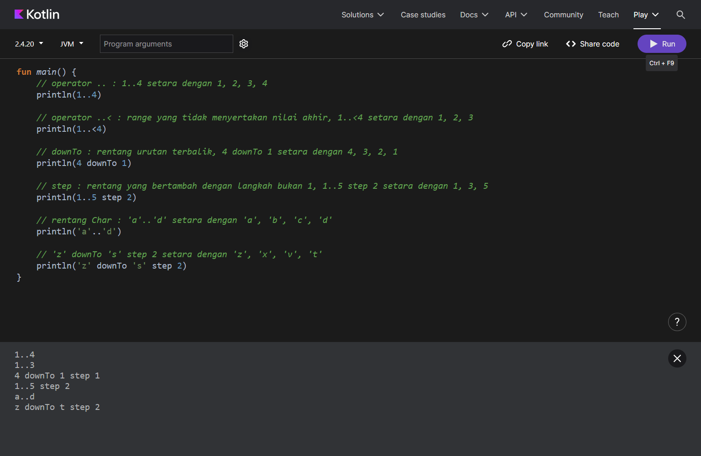

---

## 7. Loops

[`subbab/07_Loops.kt`](subbab/07_Loops.kt) · [buka di Kotlin Playground](https://play.kotlinlang.org/#eyJ2ZXJzaW9uIjoiMi40LjIwIiwicGxhdGZvcm0iOiJqYXZhIiwiYXJncyI6IiIsIm5vbmVNYXJrZXJzIjp0cnVlLCJ0aGVtZSI6ImlkZWEiLCJjb2RlIjoiZnVuIG1haW4oKSB7XG4gICAgLy8gRm9yXG4gICAgZm9yIChudW1iZXIgaW4gMS4uNSkge1xuICAgICAgICAvLyBudW1iZXIgaXMgdGhlIGl0ZXJhdG9yIGFuZCAxLi41IGlzIHRoZSByYW5nZVxuICAgICAgICBwcmludChudW1iZXIpXG4gICAgfVxuICAgIC8vIDEyMzQ1XG4gICAgcHJpbnRsbigpXG5cbiAgICAvLyBXaGlsZTogbWVuZ2Vrc2VrdXNpIGJsb2sga29kZSBzZWxhbWEgZWtzcHJlc2kga29uZGlzaW9uYWwgYmVybmlsYWkgYmVuYXJcbiAgICB2YXIgYW5na2EgPSAxXG4gICAgd2hpbGUgKGFuZ2thIDw9IDUpIHtcbiAgICAgICAgcHJpbnQoYW5na2EpXG4gICAgICAgIGFuZ2thKytcbiAgICB9XG4gICAgLy8gMTIzNDVcbiAgICBwcmludGxuKClcblxuICAgIC8vIERvLXdoaWxlOiBtZW5nZWtzZWt1c2kgYmxvayBrb2RlIHRlcmxlYmloIGRhaHVsdSwga2VtdWRpYW4gbWVtZXJpa3NhIGVrc3ByZXNpIGtvbmRpc2lvbmFsXG4gICAgdmFyIGhpdHVuZ2FuID0gNVxuICAgIGRvIHtcbiAgICAgICAgcHJpbnQoaGl0dW5nYW4pXG4gICAgICAgIGhpdHVuZ2FuLS1cbiAgICB9IHdoaWxlIChoaXR1bmdhbiA+IDApXG4gICAgLy8gNTQzMjFcbiAgICBwcmludGxuKClcbn1cbiIsImNvbXBpbGVyQXJndW1lbnRzIjp7fX0=)

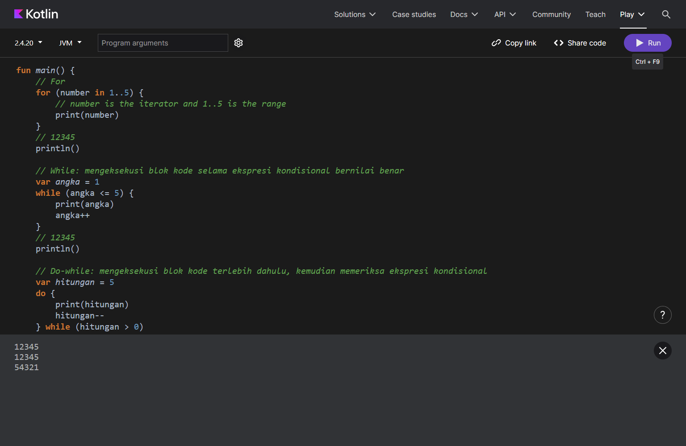

---

## 8. Functions

[`subbab/08_Functions.kt`](subbab/08_Functions.kt) · [buka di Kotlin Playground](https://play.kotlinlang.org/#eyJ2ZXJzaW9uIjoiMi40LjIwIiwicGxhdGZvcm0iOiJqYXZhIiwiYXJncyI6IiIsIm5vbmVNYXJrZXJzIjp0cnVlLCJ0aGVtZSI6ImlkZWEiLCJjb2RlIjoiLy8geCBkYW4geSBhZGFsYWggcGFyYW1ldGVyIGZ1bmdzaSwga2VkdWFueWEgYmVydGlwZSBJbnRcbi8vIHRpcGUgaGFzaWwgZnVuZ3NpIGFkYWxhaCBJbnQsIGZ1bmdzaSBtZW5nZW1iYWxpa2FuIGp1bWxhaCB4IGRhbiB5IHNhYXQgZGlwYW5nZ2lsXG5mdW4gc3VtKHg6IEludCwgeTogSW50KTogSW50IHtcbiAgICByZXR1cm4geCArIHlcbn1cblxuLy8gTmFtZWQgYXJndW1lbnRzIGRhbiBkZWZhdWx0IHBhcmFtZXRlciB2YWx1ZXNcbmZ1biBwcmludE1lc3NhZ2VXaXRoUHJlZml4KG1lc3NhZ2U6IFN0cmluZywgcHJlZml4OiBTdHJpbmcgPSBcIkluZm9cIikge1xuICAgIHByaW50bG4oXCJbJHByZWZpeF0gJG1lc3NhZ2VcIilcbn1cblxuLy8gRnVuY3Rpb25zIHdpdGhvdXQgcmV0dXJuOiB0aXBlIGtlbWJhbGlhbm55YSBVbml0LCByZXR1cm4gYm9sZWggZGloaWxhbmdrYW5cbmZ1biBwcmludE1lc3NhZ2UobWVzc2FnZTogU3RyaW5nKSB7XG4gICAgcHJpbnRsbihtZXNzYWdlKVxuICAgIC8vIGByZXR1cm4gVW5pdGAgb3IgYHJldHVybmAgaXMgb3B0aW9uYWxcbn1cblxuZnVuIHVwcGVyY2FzZVN0cmluZyhzdHJpbmc6IFN0cmluZyk6IFN0cmluZyB7XG4gICAgcmV0dXJuIHN0cmluZy51cHBlcmNhc2UoKVxufVxuXG5mdW4gbWFpbigpIHtcbiAgICBwcmludGxuKHN1bSgxLCAyKSlcbiAgICAvLyAzXG5cbiAgICAvLyBVc2VzIG5hbWVkIGFyZ3VtZW50cyB3aXRoIHN3YXBwZWQgcGFyYW1ldGVyIG9yZGVyXG4gICAgcHJpbnRNZXNzYWdlV2l0aFByZWZpeChwcmVmaXggPSBcIkxvZ1wiLCBtZXNzYWdlID0gXCJIZWxsb1wiKVxuICAgIC8vIFtMb2ddIEhlbGxvXG5cbiAgICAvLyBGdW5jdGlvbiBjYWxsZWQgd2l0aCBib3RoIHBhcmFtZXRlcnNcbiAgICBwcmludE1lc3NhZ2VXaXRoUHJlZml4KFwiSGVsbG9cIiwgXCJMb2dcIilcbiAgICAvLyBbTG9nXSBIZWxsb1xuXG4gICAgLy8gRnVuY3Rpb24gY2FsbGVkIG9ubHkgd2l0aCBtZXNzYWdlIHBhcmFtZXRlclxuICAgIHByaW50TWVzc2FnZVdpdGhQcmVmaXgoXCJIZWxsb1wiKVxuICAgIC8vIFtJbmZvXSBIZWxsb1xuXG4gICAgcHJpbnRNZXNzYWdlKFwiSGVsbG9cIilcbiAgICAvLyBIZWxsb1xuXG4gICAgcHJpbnRsbih1cHBlcmNhc2VTdHJpbmcoXCJoZWxsb1wiKSlcbiAgICAvLyBIRUxMT1xuXG4gICAgLy8gRGl0dWxpcyBkYWxhbSBla3NwcmVzaSBsYW1iZGFcbiAgICBwcmludGxuKHsgc3RyaW5nOiBTdHJpbmcgLT4gc3RyaW5nLnVwcGVyY2FzZSgpIH0oXCJoZWxsb1wiKSlcbiAgICAvLyBIRUxMT1xufVxuIiwiY29tcGlsZXJBcmd1bWVudHMiOnt9fQ==)

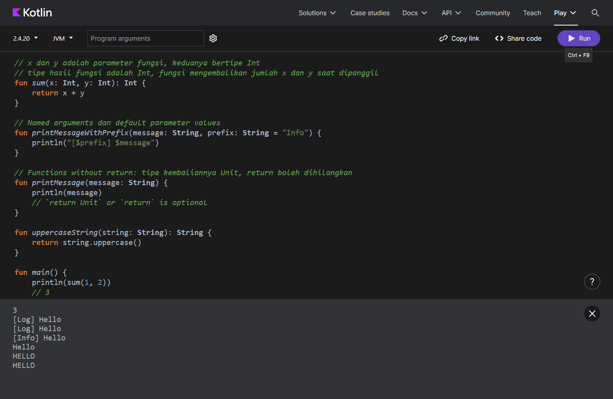

---

## 9. Class

[`subbab/09_Class.kt`](subbab/09_Class.kt) · [buka di Kotlin Playground](https://play.kotlinlang.org/#eyJ2ZXJzaW9uIjoiMi40LjIwIiwicGxhdGZvcm0iOiJqYXZhIiwiYXJncyI6IiIsIm5vbmVNYXJrZXJzIjp0cnVlLCJ0aGVtZSI6ImlkZWEiLCJjb2RlIjoiLy8gTWVuZGVrbGFyYXNpa2FuIGtlbGFzIGRlbmdhbiBrYXRhIGt1bmNpIGNsYXNzXG5jbGFzcyBDdXN0b21lclxuXG4vLyBQcm9wZXJ0aWVzIGRpZGVrbGFyYXNpa2FuIGRpIGRhbGFtIHRhbmRhIGt1cnVuZyAoKSBzZXRlbGFoIG5hbWEga2VsYXNcbmNsYXNzIENvbnRhY3QodmFsIGlkOiBJbnQsIHZhciBlbWFpbDogU3RyaW5nKSB7XG4gICAgLy8gTWVtYmVyIGZ1bmN0aW9uLCBkaWRla2xhcmFzaWthbiBkaSBkYWxhbSBiYWRhbiBrZWxhc1xuICAgIGZ1biBwcmludElkKCkge1xuICAgICAgICBwcmludGxuKGlkKVxuICAgIH1cbn1cblxuZnVuIG1haW4oKSB7XG4gICAgLy8gQ3JlYXRlIGluc3RhbmNlIG1lbmdndW5ha2FuIGtvbnN0cnVrdG9yXG4gICAgdmFsIGNvbnRhY3QgPSBDb250YWN0KDEsIFwibWFyeUBnbWFpbC5jb21cIilcblxuICAgIC8vIFByaW50cyB0aGUgdmFsdWUgb2YgdGhlIHByb3BlcnR5OiBlbWFpbFxuICAgIHByaW50bG4oY29udGFjdC5lbWFpbClcbiAgICAvLyBtYXJ5QGdtYWlsLmNvbVxuXG4gICAgLy8gVXBkYXRlcyB0aGUgdmFsdWUgb2YgdGhlIHByb3BlcnR5OiBlbWFpbFxuICAgIGNvbnRhY3QuZW1haWwgPSBcImphbmVAZ21haWwuY29tXCJcblxuICAgIC8vIFByaW50cyB0aGUgbmV3IHZhbHVlIG9mIHRoZSBwcm9wZXJ0eTogZW1haWxcbiAgICBwcmludGxuKGNvbnRhY3QuZW1haWwpXG4gICAgLy8gamFuZUBnbWFpbC5jb21cblxuICAgIC8vIENhbGxzIG1lbWJlciBmdW5jdGlvbiBwcmludElkKClcbiAgICBjb250YWN0LnByaW50SWQoKVxuICAgIC8vIDFcbn1cbiIsImNvbXBpbGVyQXJndW1lbnRzIjp7fX0=)

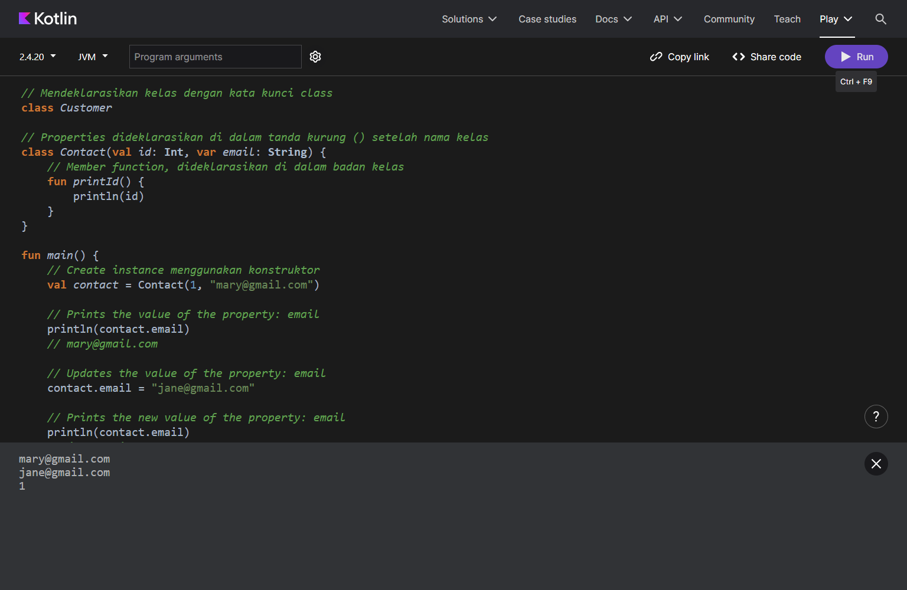

---

## 10. Data classes

[`subbab/10_DataClasses.kt`](subbab/10_DataClasses.kt) · [buka di Kotlin Playground](https://play.kotlinlang.org/#eyJ2ZXJzaW9uIjoiMi40LjIwIiwicGxhdGZvcm0iOiJqYXZhIiwiYXJncyI6IiIsIm5vbmVNYXJrZXJzIjp0cnVlLCJ0aGVtZSI6ImlkZWEiLCJjb2RlIjoiLy8gTWVuZGVrbGFyYXNpa2FuIGtlbGFzIGRhdGEgZGVuZ2FuIGthdGEga3VuY2kgZGF0YVxuZGF0YSBjbGFzcyBVc2VyKHZhbCBuYW1lOiBTdHJpbmcsIHZhbCBpZDogSW50KVxuXG5mdW4gbWFpbigpIHtcbiAgICB2YWwgdXNlciA9IFVzZXIoXCJBbGV4XCIsIDEpXG4gICAgdmFsIHNlY29uZFVzZXIgPSBVc2VyKFwiQWxleFwiLCAxKVxuICAgIHZhbCB0aGlyZFVzZXIgPSBVc2VyKFwiTWF4XCIsIDIpXG5cbiAgICAvLyBQcmludCBhcyBzdHJpbmc6IHByaW50bG4oKSBvdG9tYXRpcyBtZW1hbmdnaWwgdG9TdHJpbmcoKVxuICAgIHByaW50bG4odXNlcilcbiAgICAvLyBVc2VyKG5hbWU9QWxleCwgaWQ9MSlcblxuICAgIC8vIENvbXBhcmUgaW5zdGFuY2VzXG4gICAgcHJpbnRsbihcInVzZXIgPT0gc2Vjb25kVXNlcjogJHt1c2VyID09IHNlY29uZFVzZXJ9XCIpXG4gICAgLy8gdXNlciA9PSBzZWNvbmRVc2VyOiB0cnVlXG5cbiAgICBwcmludGxuKFwidXNlciA9PSB0aGlyZFVzZXI6ICR7dXNlciA9PSB0aGlyZFVzZXJ9XCIpXG4gICAgLy8gdXNlciA9PSB0aGlyZFVzZXI6IGZhbHNlXG5cbiAgICAvLyBDb3B5IGluc3RhbmNlOiBzYWxpbmFuIHlhbmcgdGVwYXQgZGFyaSBVc2VyXG4gICAgcHJpbnRsbih1c2VyLmNvcHkoKSlcbiAgICAvLyBVc2VyKG5hbWU9QWxleCwgaWQ9MSlcblxuICAgIC8vIENvcHkgaW5zdGFuY2UgZGVuZ2FuIG5hbWE6IFwiTWF4XCJcbiAgICBwcmludGxuKHVzZXIuY29weShcIk1heFwiKSlcbiAgICAvLyBVc2VyKG5hbWU9TWF4LCBpZD0xKVxuXG4gICAgLy8gQ29weSBpbnN0YW5jZSBkZW5nYW4gaWQ6IDNcbiAgICBwcmludGxuKHVzZXIuY29weShpZCA9IDMpKVxuICAgIC8vIFVzZXIobmFtZT1BbGV4LCBpZD0zKVxufVxuIiwiY29tcGlsZXJBcmd1bWVudHMiOnt9fQ==)

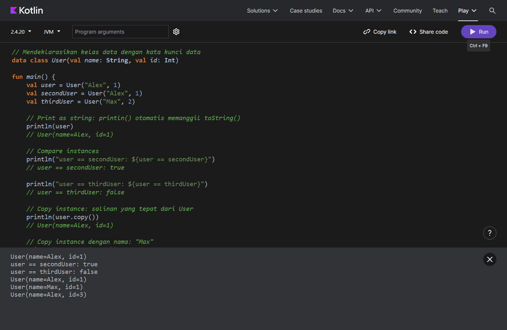

---

## 11. Null safety

[`subbab/11_NullSafety.kt`](subbab/11_NullSafety.kt) · [buka di Kotlin Playground](https://play.kotlinlang.org/#eyJ2ZXJzaW9uIjoiMi40LjIwIiwicGxhdGZvcm0iOiJqYXZhIiwiYXJncyI6IiIsIm5vbmVNYXJrZXJzIjp0cnVlLCJ0aGVtZSI6ImlkZWEiLCJjb2RlIjoiLy8gbm90TnVsbCB0aWRhayBtZW5lcmltYSBuaWxhaSBudWxsXG5mdW4gc3RyTGVuZ3RoKG5vdE51bGw6IFN0cmluZyk6IEludCB7XG4gICAgcmV0dXJuIG5vdE51bGwubGVuZ3RoXG59XG5cbi8vIENoZWNrIGZvciBudWxsIHZhbHVlc1xuZnVuIGRlc2NyaWJlU3RyaW5nKG1heWJlU3RyaW5nOiBTdHJpbmc/KTogU3RyaW5nIHtcbiAgICBpZiAobWF5YmVTdHJpbmcgIT0gbnVsbCAmJiBtYXliZVN0cmluZy5sZW5ndGggPiAwKSB7XG4gICAgICAgIHJldHVybiBcIlN0cmluZyBvZiBsZW5ndGggJHttYXliZVN0cmluZy5sZW5ndGh9XCJcbiAgICB9IGVsc2Uge1xuICAgICAgICByZXR1cm4gXCJFbXB0eSBvciBudWxsIHN0cmluZ1wiXG4gICAgfVxufVxuXG4vLyBVc2Ugc2FmZSBjYWxsczogbWVuZ2VtYmFsaWthbiBwYW5qYW5nIHN0cmluZyBhdGF1IG51bGxcbmZ1biBsZW5ndGhTdHJpbmcobWF5YmVTdHJpbmc6IFN0cmluZz8pOiBJbnQ/ID0gbWF5YmVTdHJpbmc/Lmxlbmd0aFxuXG5mdW4gbWFpbigpIHtcbiAgICAvLyBOdWxsYWJsZSB0eXBlc1xuICAgIC8vIG5ldmVyTnVsbCBoYXMgU3RyaW5nIHR5cGVcbiAgICB2YXIgbmV2ZXJOdWxsOiBTdHJpbmcgPSBcIlRoaXMgY2FuJ3QgYmUgbnVsbFwiXG4gICAgLy8gVGhyb3dzIGEgY29tcGlsZXIgZXJyb3JcbiAgICAvLyBuZXZlck51bGwgPSBudWxsXG5cbiAgICAvLyBudWxsYWJsZSBoYXMgbnVsbGFibGUgU3RyaW5nIHR5cGVcbiAgICB2YXIgbnVsbGFibGU6IFN0cmluZz8gPSBcIllvdSBjYW4ga2VlcCBhIG51bGwgaGVyZVwiXG4gICAgcHJpbnRsbihudWxsYWJsZSlcbiAgICAvLyBZb3UgY2FuIGtlZXAgYSBudWxsIGhlcmVcblxuICAgIC8vIFRoaXMgaXMgT0tcbiAgICBudWxsYWJsZSA9IG51bGxcblxuICAgIC8vIEJ5IGRlZmF1bHQsIG51bGwgdmFsdWVzIGFyZW4ndCBhY2NlcHRlZFxuICAgIHZhciBpbmZlcnJlZE5vbk51bGwgPSBcIlRoZSBjb21waWxlciBhc3N1bWVzIG5vbi1udWxsYWJsZVwiXG4gICAgLy8gVGhyb3dzIGEgY29tcGlsZXIgZXJyb3JcbiAgICAvLyBpbmZlcnJlZE5vbk51bGwgPSBudWxsXG5cbiAgICBwcmludGxuKG5ldmVyTnVsbClcbiAgICAvLyBUaGlzIGNhbid0IGJlIG51bGxcblxuICAgIHByaW50bG4obnVsbGFibGUpXG4gICAgLy8gbnVsbFxuXG4gICAgcHJpbnRsbihpbmZlcnJlZE5vbk51bGwpXG5cbiAgICBwcmludGxuKHN0ckxlbmd0aChuZXZlck51bGwpKVxuICAgIC8vIDE4XG5cbiAgICAvLyBDaGVjayBmb3IgbnVsbCB2YWx1ZXNcbiAgICB2YXIgbnVsbFN0cmluZzogU3RyaW5nPyA9IG51bGxcbiAgICBwcmludGxuKGRlc2NyaWJlU3RyaW5nKG51bGxTdHJpbmcpKVxuICAgIC8vIEVtcHR5IG9yIG51bGwgc3RyaW5nXG5cbiAgICAvLyBVc2Ugc2FmZSBjYWxsc1xuICAgIHByaW50bG4obGVuZ3RoU3RyaW5nKG51bGxTdHJpbmcpKVxuICAgIC8vIG51bGxcblxuICAgIC8vIFVzZSBFbHZpcyBvcGVyYXRvclxuICAgIHByaW50bG4obnVsbFN0cmluZz8ubGVuZ3RoID86IDApXG4gICAgLy8gMFxufVxuIiwiY29tcGlsZXJBcmd1bWVudHMiOnt9fQ==)

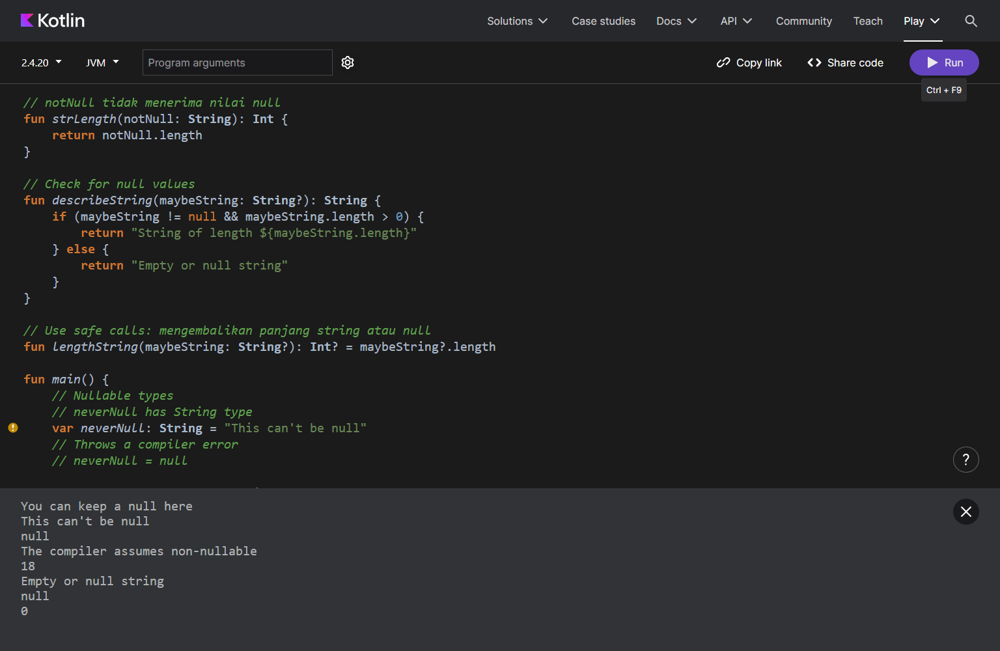
